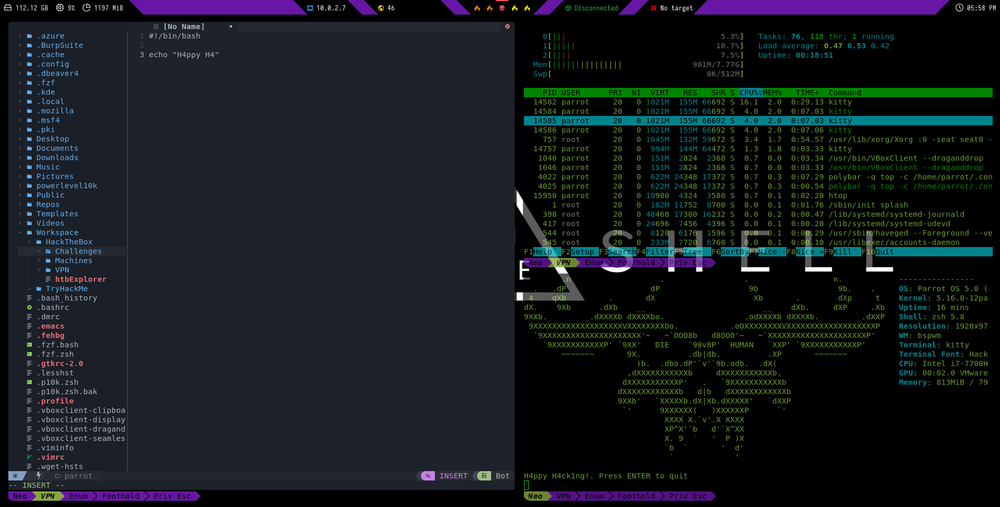
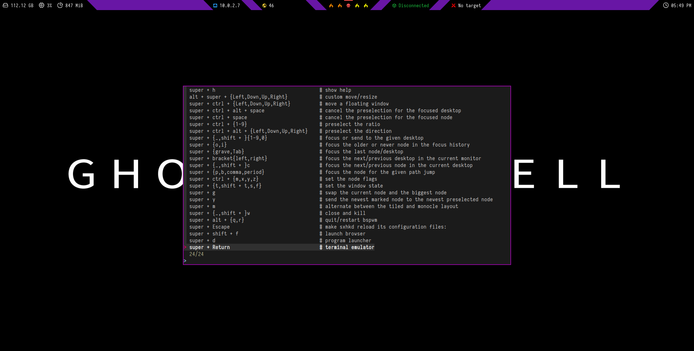
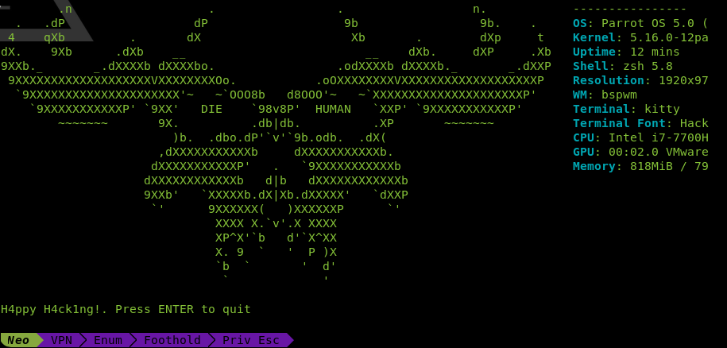

# bsGhost

## Overview



Theme for ParrotOS using bspwm and polybar. 
## Notes

> Remember to change default passwords, included the LVM disk encryption password.

> To use the htbExplorer tool you need set up the HackTheBox API key from the old interface. 
> Config file can be located in: ~/Workspace/HackTheBox/.htbExplorer

## Specifications
<details>
<summary><b>User Configuration</b></summary>

| Variable     | Value        |
| :----------- | :----------- |
| LVM password | `p4rr0t!`    |
| Hostname     | `parrotsec`  |
| Name         | `Parrot`     |
| User         | `parrot`     |
| Password     | `p4rr0ts3c!` |
</details>

<details>
<summary><b>System Configuration</b></summary>

| Programs       | Using            |
| :------------- | :--------------- |
| OS             | `ParrotOS`       |
| WM             | `bspwm`          |
| Hotkey Daemon  | `schkd`          |
| Top Bar        | `polybar`        |
| Compositor     | `picom`          |
| Terminal       | `kitty`          |
| Terminal Theme | `PowerLevel10k`  |
| Shell          | `zsh`            |
| Font           | `Hack Nerd Font` |
| Editor         | `Neovim/VSCode`  | 
</details>

<details>
<summary><b>System Resources</b></summary>

| Resource | Value        |
| :------- | :----------- |
| Disk     | `120GB`      |
| RAM      | `8GB`        |
| CPUs     | `2`          |
| Network  | `NatNetwork` |
</details>

## Features

<details>
<summary><b>Shortcut Helper</b></summary>

- <kbd>Windows</kbd> + <kbd>H</kbd> : Opens Shortcut Helper.  


</details>

<details>
<summary><b>Functions</b></summary>

- <kbd>mkt</kbd> : Create 4 directores (nmap, content, exploits, scripts)
- <kbd>extractPorts</kbd> : Extracts ports from grep file Nmap result and send it to copy buffer1
</details>

<details>
<summary><b>Alias</b></summary>

- <kbd>ssh</kbd> : Open SSH with Kitty avoiding terminal issues
- <kbd>ls</kbd> : List with steroids (LSD)
- <kbd>bat</kbd> : Cat with steroids (LSD)
- <kbd>htb</kbd> : Runs the htbExplorer tool to interact with Hack The Box machines
- <kbd>htb-vpn</kbd> : Connect to HackTheBox VPN (Needs to be downloaded and placed in: $HOME/Workspace/HackTheBox/VPN/htb_machines.ovpn)
- <kbd>starget</kbd> : Set target IP
- <kbd>utarget</kbd> : Unset target IP
- <kbd>..</kbd> : Move to parent directory
</details>

<details>
<summary><b>Browser Extensions</b></summary>

- FoxyProxy (Configured already for using Burp proxy)
- Wappalyzer
</details>

<details>
<summary><b>Polybar</b></summary>


- Free Disk Space
- CPU utilization
- Memory utilization
- Local IP (checks for enp0s3 interface)
- Public IP
- Workspaces (Free:Yellow, Busy:Orange, Active:RedSkull)
- VPN IP (checks for tun0)
- Target IP
- Date (Clickable to switch views)
</details>

<details>
<summary><b>Kitty</b></summary>

- PowerLevel10K
- Fzf 
- Feh
- Start with 5 sessions (Neo, VPN, Enum, Foothold, Priv Esc)
- Move between tabs:
    - <kbd>Ctrl</kbd> + <kbd>alt</kbd> + <kbd>⬅</kbd>
    - <kbd>Ctrl</kbd> + <kbd>alt</kbd> + <kbd>➡</kbd>
- Move between words:
    - <kbd>alt</kbd> + <kbd>⬅</kbd>
    - <kbd>alt</kbd> + <kbd>➡</kbd>
- Multiple Clipboards:
    - <kbd>F1</kbd> to copy -> <kbd>F2</kbd> to paste
    - <kbd>F3</kbd> to copy -> <kbd>F4</kbd> to paste
    - <kbd>Ctrl</kbd> + <kbd>C</kbd> to copy -> <kbd>Ctrl</kbd> + <kbd>V</kbd> to paste


</details>

## Instructions

<details>
<summary><b>OVA</b></summary>

> Only tested in Virtual Box.
> Remember to change user default credentials, included the LVM encryption passhprase

```
# Change user parrot password
$ passwd

# Change LVM encryption passphrase
$ sudo cryptsetup luksAddKey /dev/sda1
```

</details>

<details>
<summary><b>Script</b></summary>

```
$ python3 main.py
```

</details>

## Credits
- Made by @Gh0st1nth3SSH

- Configuration inspirated by @S4vitar
    - [htbExplorer](https://github.com/s4vitar/htbExplorer)
    - [BSPWM Configuration](https://www.youtube.com/watch?v=mHLwfI1nHHY)
    - [AwesomeWM Configuration](https://www.youtube.com/watch?v=fshLf6u8B-w)

- Polybar insipired by @adi1090x
    - [Polybar Themes](https://github.com/adi1090x/polybar-themes)

- Shortcut Helper inspired by @thugcee
    - [Shortcut Helper](https://www.reddit.com/r/bspwm/comments/aejyze/tip_show_sxhkd_keybindings_with_fuzzy_search/)
